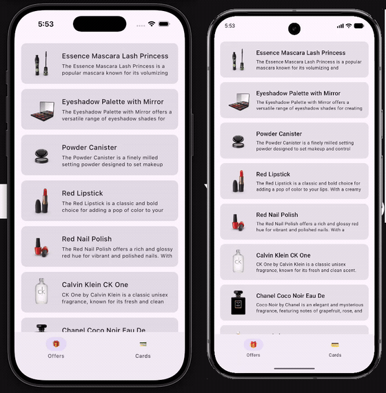

# Perks — Loyalty Wallet & Offers (Kotlin Multiplatform)

A loyalty-card wallet and offers app built with **Kotlin Multiplatform** and **Compose Multiplatform** — one Kotlin codebase, shared business logic *and* shared UI, running natively on **Android and iOS**.


<!-- TODO: record and drop in the side-by-side demo. This single GIF is the pitch. -->


> iOS (left) and Android (right) — same Compose Multiplatform UI, same shared core, one codebase.

---

## Why it's interesting

- **100% shared business logic and UI** across Android + iOS via Compose Multiplatform — including the iOS app, with no Swift UI code.
- **Offline-first** by design: the UI always reads from the local database; the network only fills it. `Ktor → SQLDelight → Flow`.
- **Encrypted secure storage** for card numbers (Keychain on iOS, encrypted storage on Android) — secrets never touch the database.
- **Clean, layered architecture**: domain / data / DI, MVVM with `StateFlow`, repository pattern, dependency injection with Koin.
- **Shared tests**: unit tests written once in `commonTest` compile and run on **both** Android and iOS.
- **CI** on GitHub Actions runs the shared test suite on both platforms on every push.

---

## Stack

| Concern | Library |
|---|---|
| Shared UI (Android + iOS) | Compose Multiplatform |
| Networking | Ktor 3 |
| Local persistence | SQLDelight |
| Dependency injection | Koin |
| Serialization | kotlinx.serialization |
| Async / reactive | Coroutines + Flow |
| Image loading | Coil 3 |
| Encrypted storage | KVault (Keychain / encrypted prefs) |
| Code rendering | QRose (QR / barcode) |
| Testing | kotlin.test + coroutines-test |
| CI | GitHub Actions (macOS runner) |

---

## Architecture

A single `:shared` module holds the core; thin platform shells launch it.

```
:shared/src
  ├─ commonMain      # domain models, repositories, Ktor client, SQLDelight,
  │                  # Koin modules, ViewModels, Compose UI  ← almost everything
  ├─ androidMain     # platform actuals: OkHttp engine, Android SQLite driver, KVault context
  ├─ iosMain         # platform actuals: Darwin engine, Native SQLite driver, Keychain
  └─ commonTest      # shared unit tests (run on Android + iOS)

:androidApp          # Android entry point
:iosApp              # iOS entry point
```

**Patterns used**

- **`expect`/`actual`** for the three things that genuinely differ per platform: the Ktor HTTP engine, the SQLDelight driver, and secure storage.
- **MVVM** — multiplatform `ViewModel`s expose UI state as `StateFlow`; Compose screens are stateless and state-driven.
- **Repository / single source of truth** — the UI observes the database; `refresh()` fetches from the API and writes to the database, which then emits to the UI. Offline support falls out of this naturally.

---

## Features

**Offers** — fetches a products/offers feed over the network, caches it locally, and renders it as a Compose list with images. Works offline from cache.

**Cards** — add a loyalty card (store name + number); the name is stored in the database while the number is encrypted in platform secure storage. Tapping a card renders its number as a scannable code.

Both features run from the same shared code on Android and iOS.

---

## Running it

**Requirements:** Android Studio (with the Kotlin Multiplatform plugin) and, for iOS, a Mac with Xcode.

**Android** — open the project in Android Studio, select the `androidApp` configuration, and run.

**iOS** — run the `iosApp` configuration from the IDE (or open `iosApp` in Xcode and run on a simulator).

**Tests**

```bash
./gradlew :shared:testAndroidHostTest      # Android / JVM
./gradlew :shared:iosSimulatorArm64Test    # iOS
```

---

## What maps to a Kotlin Multiplatform role

| Asked for | In this project |
|---|---|
| Kotlin Multiplatform (KMM) | shared core + UI, Android + iOS |
| Dependency Injection | Koin modules in commonMain |
| Modularization | `:shared` (domain / data / di / ui) + app shells |
| MVVM / Clean Architecture | ViewModels + StateFlow, layered structure |
| Reactive (Coroutines) | Coroutines + Flow throughout |
| Compose | Compose Multiplatform UI |
| Encryption | encrypted secure storage for card numbers |
| Material Design | Material 3 components |
| Automated testing | commonTest suite, runs on both platforms |
| Git, Pull Requests, CI | PR-based history, GitHub Actions |

---

## Roadmap

- [ ] Side-by-side Android + iOS demo GIF (in progress)
- [ ] UI polish: status-bar insets, title truncation, pull-to-refresh, favourite toggle
- [ ] Repository-level unit test with fakes (interfaces extracted; test pending)
- [ ] Stretch: Compose Multiplatform **Web** target
- [ ] Stretch: a native SwiftUI screen consuming the shared ViewModel
- [ ] Production-grade SQLDelight migrations (currently dev-only schema)

---

## Notes

- The offers feed uses a free public API; no real loyalty-program data is involved — the focus is the engineering.
- Built as a focused, shippable MVP: a small app done cleanly rather than a large one done loosely.